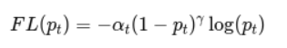

# Vấn đề
1. Class Imbalance: Nguyên nhân dẫn đến vấn đề các One-state detection định vị các hàng trăm bounding box nhưng chỉ có một vài box là có object. Mất cân bằng dữ liệu là nguyên nhân của 2 vấn đề chính.

    - Đào tạo không hiệu quả: test cho kết quả thấp hơn đáng kể so với training: Do hầu hết các mẫu train là easy negative, không đóng góp việc ra quyết định.
    - Hàng loạt các easy negative lấn át quá trình đào tạo (học thiên vị)

=> Giải pháp: Tìm hard sample trong quá trình training => Focal loss tự nhiên xử lý vấn đề class imbalance trong one-detector, giúp đào tạo hiệu quả tất cả các mẫu mà không cần sampling hay gặp hiện tượng easy negative lấn át loss và tính toán gradient.
 
# Focal loss (tổn thất tiêu điểm)
**Bài báo nói rằng mấu chốt cải tiến nằm ở Focal loss chứ không phải ở kiến trúc mạng Retinaface.**
Cải tiến từ loss function truyền thống là Cross-Entropy (CE), đề xuất để giải quyết việc mất cân bằng lớp trong quá trình huấn luyện.
Cụ thể thêm tham số gamma để nhấn mạnh việc học các lớp khó, thiểu số.

a^t là weight by class. thuộc khoảng 0,1 với 1

gamma là hyper parameter với giá trị thuộc đoạn [0,5]. Thường 2 cho kết quả tốt nhất

## Balanced Cross Entropy (CE cân bằng)
Sử dụng weight factor alpha thuộc [0,1] cho class 1 và 1-alpha cho class -1.
Được coi là Base-line tiêu chuẩn cho forcus loss
## Focal loss
Tham số cân bằng alpha không nhấn mạnh tầm quan trọng của positive/negative examples. Không có sự khác biệt giữa chúng, mọi thức được coi là như nhau. Cần down-weight của easy example và tăng weight để mô hình tập trung vào các trường hợp khó.

FR đề xuất thêm 1 hệ số điều chỉnh FL(pt)=-(1-pt)^gamma và công thức Balanced CE.
- Hiểu các thành phần chính: 
    pt gần 0 nếu dự đoán sai, pt gần 1 nếu dự đoán đúng
    lamda: điều chỉnh giảm trọng số mẫu dễ :
        =0: Balance CE:
        >0: Giảm trọng số cho các mẫu dễ c(pt gần bằng 0)
- 2 ảnh hưởng của focal loss:
    - Tác động lên mẫu dễ:
        Khi mẫu bị phân loại sai (𝑝𝑡 nhỏ), nhân tố điều chỉnh (cái thêm vào so với Balanced CE) gần bằng 1, do đó hàm mất mát không thay đổi nhiều.
        Khi mẫu được phân loại đúng (𝑝𝑡→1), nhân tố điều chỉnh tiến về 0, giảm ảnh hưởng của các mẫu dễ vào tổng hàm mất mát.
    - (2) Tác động của tham số 𝛾
        𝛾 kiểm soát mức độ giảm ảnh hưởng của các mẫu dễ.
        Khi 𝛾=0, Focal Loss giống Cross Entropy.
        Khi 𝛾 tăng, hiệu ứng giảm trọng số của các mẫu dễ cũng tăng.