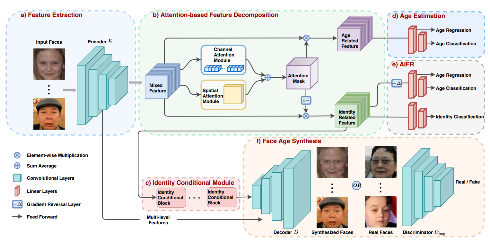
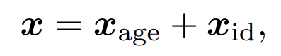

# Abstract
- Age-invariant face recognition (AIFR - nhận dạng khuôn mặt bất biến theo tuổi): giảm thiểu mối tương quan giữa các đặc điểm liên quan đến danh tính và tuổi tác => Thiếu kết quả trực quan cho việc giải thích mô hình 
- Face age synthesis (FAS - tổng hợp khuôn mặt): đưa các khuôn mặt về cùng 1 nhóm tuổi => các vật thể khác như tay và điện thoại làm ảnh hưởng đến việc nhận dạng.
- MTL Face: đề xuất 1 khuôn khổ học multi task duy nhất để cùng nhau xử lý 2 vấn đề trên. MTL có thể học cách biểu diễn liên quan đến danh tính bất biến theo độ tuổi trong khi vẫn đạt được FAS
    Phân tích feature vector thành 2 thành phần identity feature và age-related feature thông qua cơ chế attention.
    Sau khi tách được 2 thành phần rời mối quan hệ của hai thành phần này bằng multi task. 
    Ngược lại với one-hot-coding thông thường đạt được trên FAS cấp nhóm, tác giả đề xuất một module có điều kiện nhận dạng mới để đạt được FAS cấp danh tính, với chiến lược chia sẻ weight để cải thiện độ mịn theo độ tuổi bằng FAS.
    Để thúc đẩy sự phát triển của AIFR và FAS và họ thêm task về giới tính.

# Introduce
- Các hướng nghiên cứu nhận được nhiều cải thiện
    - margin-based loss: để tăng tính chặt chẽ trong từng class đào tạo
    - đào tạo trên dữ liệu lớn
    - AIFR: nhận diện khuôn mặt không dựa theo độ tuổi: khi khoảng cách tuổi tác trở nên lớn trong nhận dạng khuôn mặt theo độ tuổi, sự thay đổi độ tuổi có thể ảnh hưởng lớn đến diện mạo khuôn mặt => Làm giảm hiệu suất nhận dạng.
    - FAS: cố gắng đưa tất cả khuôn mặt về cùng một độ tuổi để nhận diện (lão hóa và trẻ hóa khuôn mặt) => Khó có thể thu thập được ảnh của cùng một người với các độ tuổi khác nhau => Khó thực bảo toàn được danh tính của khuôn mặt khi thực hiện thay đổi về tuổi.
- Để giải quyết vấn đề AIFR, có hai mô hình chính là generative (sinh) và discriminate (phân biệt)
    - Generative: chuyển đổi các khuôn mặt về cùng một nhóm tuổi để hỗ trợ việc nhận diện. Các mạng generative adversarial networks (GANs) được sử dụng thành công để tổng hợp khuôn mặt (FAS) chất lượng cao. Tuy nhiên họ sử dụng one-hot-encoding để chỉ định target age group (ví dụ 0-10 là [1,0,0,0], 11-20 là [0,1,0,0], .. các mạng này giúp chuyển đổi ảnh của 1 group này sang target group mong muốn). Tuy nhiên one-hot-encoding bỏ qua identity level (chỉ quan tâm tuổi), có thể làm mất nó trong quá trình chuyển đổi và có thể dẫn đến các trường hợp không mong muốn. => Các mô hình này không cải thiện đáng kể các khuôn mặt do tổng hợp không đẹp và những bất ngờ về danh tính có thể xảy ra.
    - Discriminate: trích xuất thông tin age-invariant features và cố gắng tách identity-only feature. Mặc dù đạt được hiệu suất đầy hứa hẹn trong vấn đề AIFR, chúng không cung cấp cho người dùng kết quả hình ảnh trực quan (ví dụ như policeman - cảnh sát, mô hình generative có thể tạo ra các hình ảnh khuôn mặt ở những độ tuổi khác nhau, giúp cảnh sát kiểm chứng trực quan danh tính của một người ở các độ tuổi khác nhau) => Khả năng đưa ra quyết định bị hạn chế và không minh bạch.

- Tóm lại: để cải thiện hơn chất lượng hình ảnh cho generative model và cung cấp khả năng diễn giải cho discriminate model họ đề xuất học đa nghiệm để đồng thời đạt được AIFR và FAS, gọi là MTLFace tổng hợp những điều tốt nhất của cả hai giải pháp mang lại.
    - Học identity feature bất biến theo độ tuổi.
    - Khả năng tổng hợp khuôn mặt tốt hơn.

- Cách hoạt động:
    - Phân tích mixed high-level features thành 2 thành phần identity feature và age-related features thông qua attention mechanism.
    - Liên hệ 2 thành phần này với nhau thông qua một khuôn khổ multi task learning framework.
        - age estimation task:
        - face recognition task:
    - Ngoài ra một continous cross-age discrimination (một bộ phân biệt tuổi - liên tục chứ không phải group) với một lớp gradient reversal layer (lớp đảo ngược)[8] khuyến khích sự liên quan giữa identity feature và age feature.
    - Hơn nữa, đề xuất identity conditional module (module học danh tính có điều kiện) để đạt được identity-level transformation patterns for FAS với một chiến lược chia sẻ trọng số để cải thiện độ mịn tuổi của các khuôn mặt được tổng hợp (FAS).

- Đóng góp:
    - Multi task để đạt được AIFR về danh tính tốt hơn và FAS mịn mạng hơn.
    - Đề xuất cơ chế attention-based feature decomposition (phân tích feature dựa trên attention) để tách tính năng liên quan đến age và identity từ high-level feature maps. 2 task được kết hợp để giám sát quá trình phân tích kết hợp với điều chỉnh miền liên tục.
    - So với one-hot-encoding để chuyển đổi khuôn mặt ở cấp độ nhóm tuổi, họ đề xuất identity conditional module để đạt được chuyển đổi khuôn mặt ở cấp độ danh tính, với chiến lược chia sẻ trọng số để cải thiện độ mịn tuổi của FAS.
    - Tái tạo được tạp dữ liệu khổng lồ phục vụ quá trình phát triển AIFR và FAS.

# Method

## 3.1. Attention-based feature Decomposition. (Phân tích feture dựa trên cơ chế attention)
Vì khuôn mặt thay đổi rất nhiều theo thời gian, nên vấn đề quan trọng của AIFR là sự thay đổi về độ tuổi thường dẫn đến khoảng cách intra-class ngày càng tăng. Do đó, rất khó để nhận dạng chính xác hai khuôn mặt của cùng một người với khoảng cách lớn, vì các biểu diễn khuôn mặt hỗn hợp bị vướng víu nghiêm trọng với thông tin không liên quan như thay đổi hình dạng (facial shape) và kết cấu khuôn mặt (texture changes).

Wang et al đề xuất một module phân tích tuyến tính để phân tích feature vector thành 2 thành phần không liên quan: 

Phân tích trên được xây dựng dựa trên residual mapping và có nhược điểm sau:
1. Thực hiện trên vector 1-D, id feature thiếu thông tin không gian của khuôn mặt, không phù hợp cho FAS.
2. Việc phân tách 2 thành phần không có cơ sở, có thể dẫn đến quá trình đào tạo không ổn định (làm thế nào để tách 2 thành phần, dùng residual ko giới hạn được)

Để giải quyết nhược điểm này, đề xuất AFD (attention-based feature decomposition). Lý do chính là việc thao tác trên các feature vector phức tạp hơn so với feature map, do các hiệu ứng lão hóa như râu và nếp nhăn xuất hiện trong không gian 3 chiều nhưng bị mất đi trong one-dimentional feature.
Họ sử dụng Resnet để trích xuất feature map. Kết luận feature map mix được tách ra làm 2 feature map như sau.

trong đó:
    ◦: phép nhân từng phần tử.
    σ: atention module. (AFD)
=> Tách được feature map bằng attention thành age estimate task và face recognition task.
    X: các thông tin background quan trọng trong FAS được bảo toàn trong identity feature map.

Attention module bao gồm 2 thành phần: channel attention (CA) and spatial attention (SA) để làm nổi bật thông tin liên quan đến tuổi ở 2 cấp độ channel và spatial. 
1. Đầu ra của 2 attention này có kích thước khác nhau, họ kéo dài chúng về origanl input size và tính trung bình.2. Các atention module khác cũng sẽ được thảo luận ở phần sau: CA, SA và CBAM.

## 3.2. Identity Conditional Module.

Các nghiên cứu FAS trước đó sử dụng one-hot-encoding để chia khuôn mặt thành các group age không chồng lấn nên nhau, do trong group này sự thay đổi của khuôn mặt nhỏ. Kết quả, mô hình tạo ra lão hóa, trẻ hóa theo nhóm tuổi. Chẳng hạn như có râu chỉ khi 30 tuổi (do học theo nhóm tuổi) => vấn đề one-hot condition.
    - one-hot encoding: biểu thị sự lão hóa.trẻ hóa theo group age và bỏ qua identity-level, đặc biệt đối với giới tính và chủng tộc khác nhau.
    - one-hot encoding: không đảm bảo độ mịn theo tuổi của khuôn mặt được tổng hợp.

Để giải quyết, họ đề xuất ICB (khối có điều kiện về danh tính) để đạt được sự lão hóa/trẻ hóa cấp danh tính với chiến lược chia sẻ:
    - Đầu vào của ICB là identity-related feature được tách ra từ AFD ở trên để học mẫu lão hóa/trẻ hóa ở cấp độ danh tính. 
    - Đề xuất weights-sharing strategy để cải thiện độ mịn tuổi của các khuôn mặt tổng hợp: một số convolution layer được share giữa các nhóm tuổi liền kề như hình 3b.

**Họ giảm Xid từ 512 xuống 128 để giảm chi phí tính toán. Một hyper parameter s để kiểm soát số lượng các bộ lọc được chia sẻ cho hai nhóm tuổi liền kề, được thiết lập thành 1/8. => 2 nhóm tuổi liền kề chia sẻ 16 bộ lọc.**

## 3.3. Multi task learning Framework
Phần này nói về AIFR và FAS

AIFS task (Nhiệm vụ nhận dạng khuôn mặt bất biến theo độ tuổi):
    - age estimation task và face recognition task hỗ trợ AFD có thể phân tích mạnh mẽ hơn.
    - age estimation task gồm 2 linear layer:
        - layer 1: 512 neutron
        - layer 2: 101 neutron ( tương ứng với các giá trị độ tuổi từ 0 đến 100) và sử dụng softmax để tính phân phối xác xuất.
    - face recognition task
        - Một lớp tuyến tính 512 neurons (phân loại danh tính bằng cách áp dụng hàm loss CosFace)

Chịu game khó quá :v